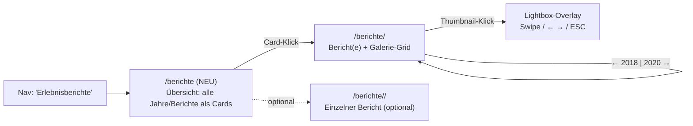

# Galerie- & Erlebnisbericht-Review – Fahrverein Planetal e.V.

> Rolle: Frontend-Spezialist Bildergalerien & Content-Präsentation
> Modus: **Nur Analyse, keine Code-Änderungen.**
> Stand: 2026-06-20
> Geprüft (vollständig gelesen, nicht geraten):
> `app/templates/main/berichte.html`, `app/main/routes.py`, `app/models.py`,
> `app/templates/admin/berichte/*` (form/_fields/list/bearbeiten), `app/admin/routes.py`,
> `app/admin/forms.py`, `app/modules/util/images.py`, `app/templates/boilerplate/{layout,nav}.html`,
> `app/static/js/nav.js`, `app/static/css/site.css`, `app/templates/index.html` (Carousel-Referenz),
> `app/static/vendor/flowbite/flowbite.min.{css,js}`, DB-Inhalt `app.db`, Bildbestand `app/static/uploads/berichte/`.

---

## 0. Kernaussage / TL;DR

Die Erlebnisberichte sind sauber ins CMS/DB migriert (Modell `Bericht` 1:n `BerichtBild`, Mehrbild-Upload, automatische WebP-Konvertierung, gute SEO/Schema.org). **Die öffentliche Galerie selbst ist jedoch das schwächste Glied der Seite** und genau hier setzt der Auftraggeber-Wunsch „bessere Galerie/Erlebnisbericht-Seite“ an. Drei harte Probleme:

1. **Keine Vergrößerung / kein Lightbox.** Bilder sind reine `` ohne Klick-Ziel. Auf einem Handy bleiben sie Briefmarken; man kann ein Foto nicht groß ansehen. Das ist für eine Fotogalerie der zentrale Mangel.
2. **Es gibt keine Übersichtsseite.** Berichte sind **ausschließlich** über das Nav-Dropdown nach Jahr erreichbar (`/berichte/<jahr>`). Es existiert keine Route/Seite „alle Jahre/Berichte als Karten“. Suchmaschinen und Laien finden die Galerie schwer; ein Direkteinstieg fehlt.
3. **Das pseudo-Masonry-Layout rendert kaputt** – aus zwei Gründen: (a) Der Spalten-Verteil-Trick verliert die `reihenfolge` (Bilder springen 0,4,8 / 1,5,9 …), (b) zentrale Klassen fehlen in der gepurgten `flowbite.min.css` (`hover:scale-105`, `prose`, `border-l-4`, `mb-12`). Der „Hover-Zoom“ und die Text-Formatierung sind damit **tot** (gleiche Grundursache wie in Review 01, Abschnitt 7).

**Gute Nachricht:** Eine moderne, mobile-taugliche Galerie ist **ohne neuen Build und fast ohne neue Assets** machbar. Flowbite bringt eine **`Modal`-Komponente** (24 Treffer in `flowbite.min.js`, `data-modal-*`) und einen **`Carousel`** (`data-carousel*`) mit – beide werden bereits auf der Startseite genutzt. Daraus lässt sich eine vollwertige Lightbox mit Swipe/Tasten bauen. Eine **dedizierte Lightbox/Gallery-Komponente hat Flowbite (free) NICHT** (`grep lightbox|gallery|data-gallery` = 0 Treffer).

---

## 1. Aktuelle Implementierung (Faktenlage)

### 1.1 Datenmodell (`app/models.py:100–137`)

```
Bericht(id, jahr:int, titel:str(200), text:Text(HTML, bleach-bereinigt),
        reihenfolge:int, veroeffentlicht:bool)
  └─ bilder = relationship(BerichtBild, order_by=BerichtBild.reihenfolge,
                           cascade="all, delete-orphan")        # 1:n, sortiert

BerichtBild(id, bericht_id→berichte.id, dateiname:str(255),
            reihenfolge:int, alt_text:str(255))
```

- Modell ist **sauber und ausreichend** für eine gute Galerie: Sortierung (`reihenfolge`) und A11y (`alt_text`) sind vorgesehen.
- Die Relationship lädt per Default **lazy** -> in `berichte.html` wird `bericht.bilder` mehrfach iteriert (4× durch den Spalten-Trick, s. u.). Pro Jahr ist das tragbar, aber es entsteht je Bericht ein N+1-Query (kein `joinedload`/`selectinload` in `erlebnisberichte`, `routes.py:36`).

### 1.2 Öffentliche Route (`app/main/routes.py:33–46`)

```python
@main.route('/berichte/<int:jahr>')
def erlebnisberichte(jahr):
    berichte = (Bericht.query
        .filter_by(jahr=jahr, veroeffentlicht=True)
        .order_by(Bericht.reihenfolge.asc(), Bericht.titel.asc()).all())
    if not berichte: abort(404)
    return render_template('main/berichte.html', jahr=jahr, berichte=berichte)
```

- **Pro Jahr eine Seite.** Alle Berichte eines Jahres untereinander.
- **Kein Index/Overview-Endpoint.** Es gibt nur diese eine Detail-Route. Keine `GET /berichte` Landing-Page.
- Kein `selectinload(Bericht.bilder)` -> N+1 (S, Performance).

### 1.3 Navigation (`nav.html:26–47`, `nav.js`)

- Erlebnisberichte = **Dropdown mit Jahres-Liste** (`reports` aus `inject_reports`, `routes.py:16–30`). Defensiv (try/except SQLAlchemyError -> leere Liste). Gut.
- ARIA am Button korrekt (`aria-haspopup/expanded/controls`), Escape schließt, Außenklick schließt. Solide.
- **Aber:** Das Dropdown ist der **einzige** Zugang zur gesamten Galerie. Wer die Maus nicht über „Erlebnisberichte“ bewegt, erfährt nie, dass es Fotos gibt. Mobil ist das Dropdown ein zusätzlicher Tap-in-Tap.

### 1.4 Galerie-Template (`app/templates/main/berichte.html`)

Kernstück, Zeilen 22–42:

```jinja
<div class="grid grid-cols-2 md:grid-cols-4 gap-4" itemscope itemtype=".../ImageGallery">
  
    <div class="grid gap-4">
      
        {% if loop.index0 % 4 == col %}
          <figure class="relative group">
            
          </figure>
        
      
    </div>
  
</div>
```

Befund Punkt für Punkt:

| Aspekt | Status | Detail |
|---|---|---|
| **Vergrößerung/Lightbox** | ❌ fehlt | `` ohne Link/Button/Modal. Foto kann nicht groß betrachtet werden. **Kernmangel.** |
| **Layout/Grid** | ⚠️ fehlerhaft | Künstliches „Masonry“ über 4 fixe Spalten + `loop.index0 % 4 == col`. **Bricht die `reihenfolge`** (Spalte 0 = Bild 1,5,9; Spalte 1 = 2,6,10 …). Bei `md:` 2 Spalten (Mobile) füllen aber trotzdem 4 Innen-Grids -> 2 davon erzeugen leere/halbe Spalten. |
| **Lazy-Loading** | ✅ vorhanden | `loading="lazy"` an jedem ``. Gut. |
| **Bildformate (WebP)** | ✅ teilweise | Upload speichert **immer** WebP (`images.py:82`, `quality=82`, max. Kante 1600px). Aber: **nur eine Größe** ausgeliefert (keine `srcset`/responsive Varianten, keine Thumbnails). |
| **Responsive** | ⚠️ | `grid-cols-2 md:grid-cols-4` ok, aber durch den Spalten-Trick (s. o.) unsauber; keine `lg:`-Stufe. |
| **Performance bei vielen Bildern** | ❌ Risiko | Vollbilder bis ~1600px / **bis 517 KB** je Datei werden als Grid-Thumbnails geladen. Bericht 7 hat **20 Bilder**, gesamt 107 Bilder (27 MB) in `uploads/berichte`. Eine Jahresseite mit 20 Vollbild-WebPs = mehrere MB nur für Mini-Vorschauen. `lazy` mildert, löst es nicht. |
| **Hover-Zoom** | ❌ tot | `hover:scale-105` ist **nicht** in `flowbite.min.css` (verifiziert: MISSING). Effekt rendert nie. |
| **Text-Formatierung** | ❌ tot | `prose` und `border-l-4` **fehlen** in der CSS (verifiziert: MISSING). Der gelbe Akzentbalken (`border-l-4 border-yellow-400`) und das `prose`-Styling des `bericht.text` greifen nicht. `mb-12` fehlt ebenfalls. |
| **Navigation Jahr↔Jahr** | ❌ fehlt | Auf der Detailseite keine „← 2018 / 2020 →“-Navigation, kein Zurück-zur-Übersicht. Nur über Nav-Dropdown. |
| **A11y alt-Texte** | ⚠️ Modell ok, Daten leer | Spalte `alt_text` existiert, **aber alle 107 Bilder haben `alt_text = NULL`** (DB-geprüft). Es greift der Fallback `bericht.titel ~ ' - Fahrverein Planetal'` -> alle Bilder eines Berichts haben **denselben** Alt-Text. Für Screenreader/SEO suboptimal. |
| **SEO/Schema.org** | ✅ stark | `ImageGallery` + `ImageObject` + JSON-LD `Article` mit publisher/mainEntityOfPage. Sehr ordentlich. |

### 1.5 Admin / Mehrbild-Upload (`app/admin/routes.py:338–525`, `admin/berichte/bearbeiten.html`)

- **Upload:** `BildUploadForm.bilder = MultipleFileField` -> `_add_bilder()` speichert alle Dateien als WebP, hängt `reihenfolge` fortlaufend an (`start = max(reihenfolge)+1`). Robust: ungültige Dateien werden übersprungen + gesammelt geflasht.
- **Pro Bild:** Alt-Text + Reihenfolge editierbar (`bericht_bild_aktualisieren`). Löschen einzeln + ganzer Bericht (mit Datei-Cleanup).
- **Schwächen Admin-UX (relevant fürs Ziel „bessere Berichtsseite“):**
  - **Reihenfolge nur per Zahlenfeld**, kein Drag&Drop, kein „nach oben/unten“. Bei 20 Bildern mühsam.
  - **Kein Vorschau-Reorder/Cover-Bild-Auswahl.** Welches Bild wird Karten-Titelbild der künftigen Übersicht? Aktuell implizit „reihenfolge=0“.
  - `_fields.html` nutzt `js-wysiwyg` (Quill) für `text`. Konsistent.
  - **Validierungslücke:** `BildUploadForm.bilder` hat **keinen** `FileAllowed`-Validator (anders als `VorstandForm.foto`). Die Server-Härtung in `save_image()` fängt es ab, aber UX-Feedback ist schlechter (M).

### 1.6 Bildbestand / Migration

- **Aktiv (CMS):** `app/static/uploads/berichte/` = 107 WebP, 27 MB, Größen bis 1600px, einzelne bis 517 KB. Dateinamen = `secrets.token_hex(16).webp`.
- **Legacy (nur Import-Quelle):** `app/static/berichte/<jahr>/<event>/image_*.{jpg,webp}` = **198 Dateien, 98 MB**. Wird nur noch von `app/cli.py:286` (Einmal-Import) gelesen, **von keinem Template/Route** referenziert (verifiziert). Im aktuellen `git status` teils schon gelöscht. -> **Kandidat zum Entfernen** (spart 98 MB Repo, S).

---

## 2. Flowbite-Komponenten-Check (Aufgabe 3)

```
$ grep -o 'lightbox|gallery|data-gallery' flowbite.min.js   ->  0 Treffer
```

**Keine** dedizierte Lightbox/Gallery in Flowbite (free). Vorhanden und nutzbar:

| Komponente | Treffer JS | Data-API (im JS verifiziert) | Eignung Galerie |
|---|---|---|---|
| **Modal** | 24× | `data-modal-target/-toggle/-show/-hide`, `-backdrop`, `-placement` | ✅ **Lightbox-Container** (Overlay, Backdrop, ESC/Outside-Close gratis) |
| **Carousel** | 10× `Carousel`/12× `carousel` | `data-carousel`, `-item`, `-prev`, `-next`, `-slide-to`, `-interval` | ✅ **Bild-zu-Bild-Navigation** inkl. Prev/Next-Buttons (schon auf `index.html` im Einsatz) |
| Accordion/Tabs/Tooltip/Drawer/Dismiss/Popover | je 10–20× | – | Für Galerie nicht primär nötig |

**Auto-Init:** `flowbite.min.js` registriert am Ende `new Events("load", [..initCarousels, ..initModals ..]).init()` -> Komponenten initialisieren sich beim `load`-Event **automatisch**, sobald die `data-*`-Attribute im DOM sind. Kein eigener Init-Code nötig (Startseiten-Carousel beweist das).

**Wichtig:** Carousel **swipe/touch** ist in der vendored Version nicht garantiert (Flowbite-Carousel reagiert primär auf die Buttons/Indikatoren). Für echtes Mobile-Swipe + Tastatur-Pfeile empfiehlt sich ein **kleines eigenes JS** (s. 4.2).

**CSS-Bausteine verifiziert vorhanden** (`flowbite.min.css`): `fixed`, `inset-0`, `z-50`, `hidden`, `opacity-0/100`, `transition-opacity`, `backdrop-blur`, `object-cover`, `cursor-pointer`, `rounded-lg`, `shadow-lg`, `hover:shadow-lg`, `group`+`group-hover`, `grid-cols-2/3/4`, `sm:grid-cols-2`, `md:grid-cols-3/4`, `lg:grid-cols-3/4`, `max-h-*`, `max-w-screen-lg`, `translate-*`, `rounded-full`.

**CSS-Bausteine, die FEHLEN** (müssten in `site.css` nachgeliefert werden): `hover:scale-105` / `scale-105`, `prose`, `border-l-4`, `mb-12`, `aspect-square` / `aspect-video` / `aspect-[4/3]`, `line-clamp-2`, `columns-2/3` (echtes CSS-Masonry).

---

## 3. Bewertung der Galerie-UX (Zusammenfassung Aufgabe 2)

**Was gut ist:** semantisches HTML, Schema.org/JSON-LD, `loading="lazy"`, serverseitige WebP-Konvertierung, sauberes Datenmodell mit Sortierung & Alt-Text-Feld.

**Was fehlt / kaputt ist (priorisiert):**
1. Keine Lightbox/Vergrößerung (Kernziel des Auftrags).
2. Keine Übersichts-/Landing-Seite; Zugang nur via Dropdown.
3. „Masonry“ zerstört Reihenfolge + bricht auf Mobile; Hover-Zoom & `prose` tot (CSS gepurged).
4. Nur 1 Bildgröße (keine `srcset`/Thumbs) -> 20 Vollbilder als Grid-Vorschau = schwere Seite.
5. Alle Alt-Texte leer -> A11y/SEO ungenutzt.
6. Keine Jahr↔Jahr/Zurück-Navigation auf Detailseite.
7. N+1-Query (kein eager loading der Bilder).

---

## 4. Empfohlener Ansatz (Aufgabe 4) – modern, mobil, OHNE schweren Build

Leitplanken eingehalten: nur Klassen, die in `flowbite.min.css` existieren, plus wenige saubere Ergänzungen in `site.css`. Maximal **eine** kleine eigene JS-Datei (`gallery.js`, ~2–3 KB), keine externe Lib, kein npm/Tailwind-Build.

### 4.1 Grid statt pseudo-Masonry

- **Empfehlung:** klares, responsives **CSS-Grid mit fester Aspect-Ratio**:
  `grid grid-cols-2 sm:grid-cols-3 lg:grid-cols-4 gap-4` (alle vorhanden) und je Kachel `aspect-square`/`aspect-[4/3]` + `object-cover` für ruhige, gleichmäßige Kacheln. `aspect-*` und ggf. `object-cover`-Boundary müssen in `site.css` ergänzt werden (3 Zeilen). Vorteil: keine `reihenfolge`-Verfälschung, deterministisch, kein Layout-Sprung.
- **Alternative „echtes Masonry“** ohne JS: `columns-2 sm:columns-3 lg:columns-4` + `break-inside-avoid` (CSS-Columns). Erzeugt den verschachtelten Look ohne den Jinja-Spalten-Trick und **ohne** die Reihenfolge zu zerstören (Spaltenfluss = Lesereihenfolge spaltenweise; falls strikte Reihenfolge gewünscht, Grid wählen). `columns-*` fehlt in der CSS -> in `site.css` nachliefern (wenige Zeilen) oder Grid bevorzugen. **Empfehlung: Grid mit Aspect-Ratio** (vorhersehbarer, mobilfreundlicher, A11y-Reihenfolge bleibt erhalten).

### 4.2 Lightbox: Flowbite-Modal + Carousel (empfohlen) ODER schlanke Vanilla-JS

**Variante A – Flowbite-Bordmittel (kein/kaum eigenes JS):**
Ein **Modal** (`data-modal-target`) als Overlay, darin ein **Carousel** (`data-carousel`) mit allen Bildern des Berichts als `data-carousel-item`. Thumbnails im Grid sind Buttons mit `data-modal-show="galerie-<bericht.id>"` + `data-carousel-slide-to="<index>"`. Vorteile: ESC-Close, Backdrop-Close, Prev/Next-Buttons, Auto-Init – alles geschenkt. Nachteil: Swipe und Pfeiltasten nicht garantiert; großes Markup (alle Bilder doppelt im DOM).

**Variante B – schlanke eigene Lightbox (empfohlen für beste Mobile-UX):**
Ein **einziges** Modal-Overlay pro Seite (`fixed inset-0 z-50 hidden bg-black/90 backdrop-blur transition-opacity` – alle Klassen vorhanden), ein `` darin. Thumbnails tragen `data-full="<url>"`, `data-alt="…"`, `data-index`. `gallery.js` (~2–3 KB, vanilla) liefert:
- Klick/Tap öffnet Overlay, setzt `src`/`alt`,
- **Tastatur:** ← → (prev/next), Esc (schließen), Home/End,
- **Swipe:** `touchstart/touchend` (deltaX-Schwelle) für mobiles Wischen,
- **smooth transitions:** `opacity-0`↔`opacity-100` (vorhanden) statt totem `scale`,
- **A11y:** `role="dialog"`, `aria-modal="true"`, Focus-Trap, Fokus-Rückgabe auf das auslösende Thumbnail, `aria-label` aus `alt_text`,
- Prev/Next-Buttons (`rounded-full`, `bg-white/30`, SVG – exakt wie das Startseiten-Carousel, Klassen vorhanden),
- Counter „3 / 20“.

**Empfehlung:** **Variante B.** Geringeres DOM-Gewicht (Thumbnails statt doppelter Vollbilder), echte Swipe-/Tastatur-Bedienung, volle A11y-Kontrolle, smooth Transition mit vorhandenen Klassen. Aufwand überschaubar (eine kleine JS-Datei).

### 4.3 Performance / Bildauslieferung

- **Thumbnails erzeugen:** `save_image()` sollte zusätzlich eine kleine Variante (z. B. `…_thumb.webp`, max. Kante 400–600px) speichern. Grid lädt Thumb, Lightbox lädt Vollbild. Reduziert die Jahresseite von mehreren MB auf einige hundert KB. (M, Server-seitig, kein Frontend-Build.)
  - Minimal-Alternative ohne Migration: `width`/`height`-Attribute setzen (CLS vermeiden) + `decoding="async"` ergänzen; bringt aber keine Bytes-Ersparnis.
- **`srcset`/`sizes`** sind erst sinnvoll, wenn mehrere Größen existieren (s. o.).
- **`fetchpriority="low"`** für untere Bilder optional.

### 4.4 A11y

- `alt_text` im Admin **verpflichtend bzw. prominent** machen (aktuell alle leer). Optional Pflichtfeld oder „Alt-Text generieren aus Titel + Nr.“ als Default beim Upload, damit nicht alle Bilder denselben Text teilen.
- Lightbox: Fokus-Management + `aria-modal` (s. 4.2).
- Skip-/Fokus-Ringe greifen erst, wenn die in Review 01 genannten CSS-Lücken geschlossen sind (gemeinsame Wurzel).

---

## 5. Konkreter Vorschlag: neue Galerie-/Berichtsstruktur (Aufgabe 5)

### 5.1 Routen-/Seitenkonzept



- **Neue Übersichtsseite `GET /berichte`** (Index aller Jahre). Macht die Galerie auffindbar (auch für Google) und gibt dem Dropdown ein „Alle Berichte“-Ziel. Empfehlung: Dropdown behält Jahre, bekommt aber zusätzlich ganz oben „Alle Erlebnisberichte“.
- **Detailseite `/berichte/<jahr>`** bleibt, wird überarbeitet (Grid + Lightbox + Jahr-Navigation).

### 5.2 Wireframe in Worten – Übersicht `/berichte`

```
[ H1: Erlebnisberichte ]
[ optional: Jahres-Filter-Chips: 2019 2018 2017 … (Anker/Links) ]

┌── Card ───────────┐ ┌── Card ───────────┐ ┌── Card ───────────┐
│ [Cover-Thumb 4:3] │ │ [Cover-Thumb]     │ │ [Cover-Thumb]     │
│ Jahr-Badge 2019   │ │ 2018              │ │ 2018              │
│ Titel d. Berichts │ │ 6. Kutschertag    │ │ Gelassenheitsprüf.│
│ 10 Fotos · Teaser │ │ 20 Fotos          │ │ 8 Fotos           │
└───────────────────┘ └───────────────────┘ └───────────────────┘
  Grid: grid-cols-1 sm:grid-cols-2 lg:grid-cols-3 gap-6
  Card: bg-white rounded-lg shadow hover:shadow-lg transition  (alle vorhanden)
  Cover = erstes Bild (reihenfolge=0); Foto-Count aus bilder|length
```

- **Komponente Card:** Cover-Bild (`object-cover` + Aspect-Ratio), Jahres-Badge, Titel, Foto-Anzahl, kurzer Text-Teaser (`text | striptags | truncate`). Verlinkt auf `/berichte/<jahr>` (Anker `#bericht-<id>`).
- **Verhalten:** reine Links, kein JS nötig; Hover-`shadow` (Klasse vorhanden) als Feedback.

### 5.3 Wireframe in Worten – Detail `/berichte/<jahr>`

```
[ ← Übersicht ]            [ ‹ 2018      2019      2020 › ]   (Jahr-Navigation)

## Bericht-Titel  ·  Jahr-Badge
┌─ Text (prose, gelber Akzentbalken links) ────────────────┐
│  bereinigtes HTML …                                      │
└──────────────────────────────────────────────────────────┘

Galerie:
┌──┐ ┌──┐ ┌──┐ ┌──┐
│  │ │  │ │  │ │  │   grid grid-cols-2 sm:grid-cols-3 lg:grid-cols-4 gap-4
└──┘ └──┘ └──┘ └──┘   Kachel: aspect-[4/3] object-cover rounded-lg, als <button>
…                      lädt *_thumb.webp, loading=lazy

(weitere Berichte des Jahres darunter, je mit eigener Galerie)

— Lightbox-Overlay (1× pro Seite) —
[ ✕ ]                                   [ 3 / 20 ]
        ‹                  [ Vollbild ]                ›
        (Caption = alt_text)
  fixed inset-0 z-50 bg-black/90 backdrop-blur transition-opacity
  Swipe / Pfeiltasten / ESC ; Fokus-Trap ; aria-modal
```

- **Komponenten:** (1) Jahr-Navigation (Prev/Next aus `inject_reports`-Liste ableitbar), (2) Bericht-Header mit `prose`-Text (CSS nachliefern), (3) Galerie-Grid (Buttons), (4) eine geteilte Lightbox.
- **Übersicht vs. Detail:** Übersicht = Entdecken/SEO/Einstieg (Cards je Bericht). Detail = Konsum (Lesen + Galerie + Lightbox). Klare Trennung.

---

## 6. Priorisierte Empfehlungen (Aufgabe 6)

Aufwand: S ≤ ~1 h · M = halber Tag · L ≥ 1 Tag. „Build nötig?“ = nein bei allen (vendored CSS + `site.css` + ggf. 1 JS-Datei).

### Hoch

| # | Empfehlung | Datei:Zeile | Aufwand | Neue Assets/JS |
|---|---|---|---|---|
| H1 | **Lightbox einbauen** (Vergrößerung). Variante B: 1 Overlay + `gallery.js`; Thumbnails als `<button data-full data-alt data-index>`. Swipe + ← → + ESC + Fokus-Trap. | `berichte.html:22–42` (neu); neu `static/js/gallery.js` | M | 1 kleine JS-Datei (~2–3 KB), kein externes Lib |
| H2 | **Übersichtsseite `GET /berichte`** (Cards aller Berichte/Jahre) + Nav-Link „Alle Erlebnisberichte“. Macht Galerie auffindbar (UX+SEO). | neu in `main/routes.py` (nach :46); neu `main/berichte_index.html`; `nav.html:34–46` | M | nein |
| H3 | **Pseudo-Masonry ersetzen** durch deterministisches `grid grid-cols-2 sm:grid-cols-3 lg:grid-cols-4` + `aspect-[4/3] object-cover`. Behebt Reihenfolge-Bug & Mobile-Bruch. | `berichte.html:23–41` | S | nein (3 Zeilen `aspect-*` in `site.css`) |
| H4 | **Fehlende CSS-Klassen nachliefern** (`prose`, `border-l-4`, `mb-12`, `scale-105`/Hover, `aspect-*`). Sonst bleiben Text-Akzent, Hover, Spacing tot. (Gleiche Wurzel wie Review 01 §7.) | `static/css/site.css:37` (append) | S | nein |

### Mittel

| # | Empfehlung | Datei:Zeile | Aufwand | Neue Assets/JS |
|---|---|---|---|---|
| M1 | **Thumbnails serverseitig erzeugen** (`…_thumb.webp`, Kante ~500px) und im Grid ausliefern; Vollbild nur in Lightbox. Reduziert Jahresseite drastisch. | `modules/util/images.py:42–85`; `admin/routes.py:_add_bilder:338`; Modell ggf. `thumb`-Spalte `models.py:123` | M | nein |
| M2 | **Eager Loading** der Bilder (`selectinload(Bericht.bilder)`), behebt N+1. | `main/routes.py:36` | S | nein |
| M3 | **Alt-Texte befüllen** (alle 107 leer). Admin: Alt-Text prominenter/empfohlen, Default = `Titel – Foto N`. A11y/SEO. | `admin/berichte/bearbeiten.html:35`; `admin/routes.py:_add_bilder:359` | M | nein |
| M4 | **Jahr↔Jahr-Navigation + „Zurück zur Übersicht“** auf Detailseite. | `berichte.html:3–8`; Daten aus `inject_reports` `routes.py:16` | S | nein |
| M5 | **`FileAllowed`-Validator** für `BildUploadForm.bilder` (Client-Feedback wie bei Vorstand-Foto). | `admin/forms.py:104–108` | S | nein |
| M6 | **Cover-Bild/Reihenfolge im Admin** komfortabler: Drag&Drop ODER „↑/↓“. Bei 20 Bildern relevant. | `admin/berichte/bearbeiten.html:25–56` | M | optional kleines JS |

### Niedrig

| # | Empfehlung | Datei:Zeile | Aufwand | Neue Assets/JS |
|---|---|---|---|---|
| N1 | **Legacy-Bildordner entfernen** (`app/static/berichte/`, 198 Dateien/98 MB) – nur noch Import-Quelle, nirgendwo gerendert. CLI-Import dokumentieren/archivieren. | `app/static/berichte/*`; Hinweis `app/cli.py:286` | S | nein |
| N2 | **`width`/`height` + `decoding="async"`** an `` gegen Layout-Shift (CLS). | `berichte.html:29–33` | S | nein |
| N3 | **`/berichte/<jahr>` in Sitemap** aufnehmen (aktuell nur arg-lose Routen, `routes.py:140`). SEO. | `main/routes.py:139–157` | S | nein |
| N4 | **Toten `main/index.html`-Platzhalter** prüfen/entfernen (Aufräumen, siehe Review 01). | `app/templates/main/index.html` | S | nein |
| N5 | **`og:image` pro Bericht** (erstes Bild) für Social-Sharing-Vorschau. | `boilerplate/layout.html:13` + `berichte.html` block | S | nein |

---

## 7. Umsetzungs-Reihenfolge (Vorschlag)

1. **H4** (CSS-Lücken) zuerst – sonst rendern H1/H3 nicht wie gedacht (gemeinsame Wurzel).
2. **H3** (sauberes Grid) + **H1** (Lightbox) – das ist der vom Auftraggeber gewünschte Kern „bessere Galerie“.
3. **H2** (Übersichtsseite) – macht die neue Galerie auffindbar.
4. **M2/M1** (Performance), **M3/M4** (A11y & Navigation).
5. **N1** (98 MB Altlast) + restliche Aufräum-/SEO-Punkte.

**Gesamteinschätzung:** Das Ziel „bessere Galerie/Erlebnisbericht-Seite“ ist mit den vendored Flowbite-Mitteln (Modal/Carousel als Vorbild), einer kleinen eigenen `gallery.js` und wenigen Zeilen `site.css` **vollständig erreichbar – ohne neuen Build und ohne externe Bibliothek**. Das Datenmodell trägt bereits alles Nötige (Reihenfolge, Alt-Text); es muss „nur“ im Frontend und beim Thumbnailing gehoben werden.
